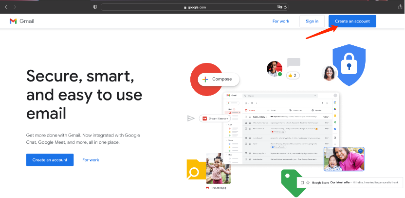
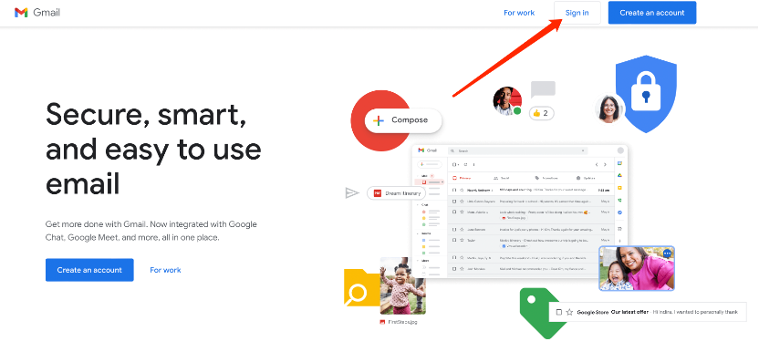
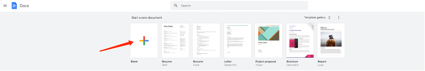
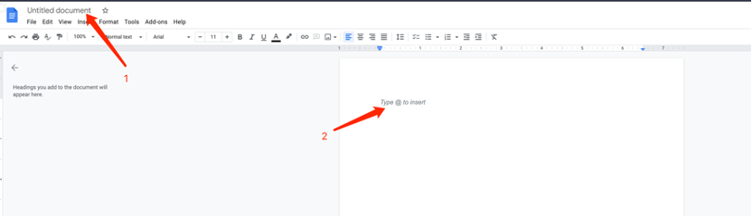
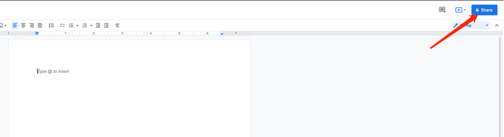
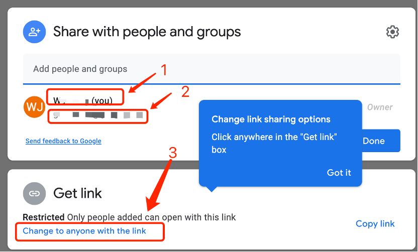
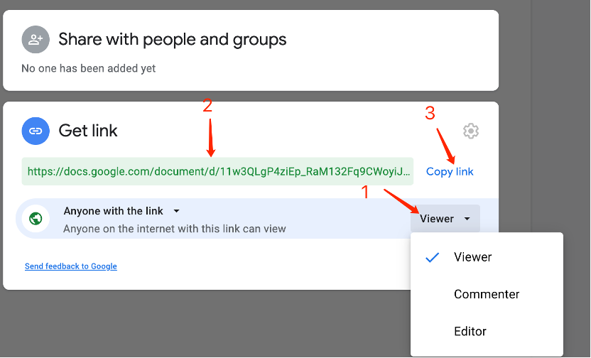

# How to get a google doc shared link

## 1. Get an Gmail Account

Go to http://www.gmail.com to register a gmail account if you don’t have one already.

And follow the instruction to get yourself a Gmail account. **(if you don’t know how, please google it and get it done.)**

## 2. Login into your Gmail account:

## 3. Then go to [Google Doc](https://docs.google.com/)

Then click on Blank to create an empty file:

Click on 1 to change the file name you want.

Click on 2 to type your word document.

After you are ready, click on the blue [Share] button at the top right corner of the browser:

The permission panel appears:

* 1 is your name of the gmail account
* 2 is the gmail address
* 3 is where we need to change the permission

Click on 3 “Change to anyone with the link” go to next page

* 1 is where you can change the file permission. Change it to Editor if you want the Doc to be edited by other, change it to Commenter if you need others help for comments, or leave it to Viewer if you just want to give out read permission.
* 2 is the actual link you will share.
* 3 is the button you click to copy the file link.

Change the permission based on your needs, then click on Copy link.
You are all set!
