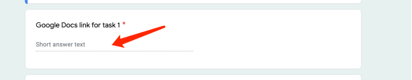

### FYI (stands for 'FOR YOUR INFORMATION'):

Some students **asked** us why we use **Google Doc** and **Gmail**, rather than other tools, such as Microsoft Office 365 and other free tools.

One of the most important reasons is that for **remote jobs** you are going to apply, the prospect employer tends to use a suite from Google to **Save money**. Especially for smaller companies. Microsoft Office costs are **too high** for small players.

Another reason is that, once you have Google credentials from services such as Gmail, you can log in to other services such as LinkedIn with the Google account, which will **save time** and make your life a lot easier.

We want our students to be equipped as much as possible to gain some **REAL Working Experience** as a remote worker.

If you have any questions, feel free to post them on the WeChat group, and we will guide you along the way.

## 1. Get an Gmail Account

Go to http://www.gmail.com to register a gmail account if you don’t have one already.

And follow the instruction to get yourself a Gmail account. **(if you don’t know how, please google it and get it done.)**

## 2. Login into your Gmail account:

## 3. Then go to [Google Doc](https://docs.google.com/)

Then click on Blank to create an empty file:

Click on 1 to change the file name you want.

Click on 2 to type your word document.

After you finish your Resume, click on the blue [Share] button at the top right corner of the browser:

The permission panel appears:

* 1 is your name of the gmail account
* 2 is the gmail address
* 3 is where we need to change the permission

Click on 3 “Change to anyone with the link” go to next page

* 1 is where you can change the file permission, change it to Editor.
* 2 is the actual link for your homework.
* 3 is the button you click to copy the file link.

First change the permission to Editor, then click on Copy the link.

Now you have the link for the cv you produce.

## 4. Finally, go to the submit form within your email for that task.

Then paste the link you copied above in here:

That’s it.

[eleduc team](https://www.eleduck.com)
